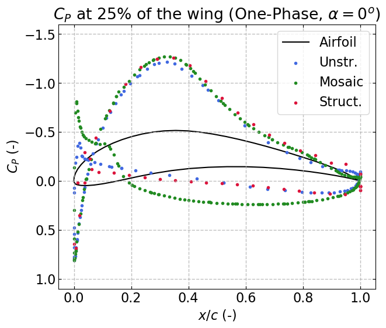

# Plot_Cp
 
 This code creates some plots of the Cp distribution around an Eppler 420 airfoi. 
 
 ---
 
 It uses:
 * Some ".xy" files for the values of Cp (generated form ANSYS Fluent)
 * One ".csv" file for the coordinates of the airfoil (from http://airfoiltools.com/).
 
 The data is transformed to represent a dimensionless airfoil cord.
 
 ---
 
 The plots look like this:
 
 

  
 

